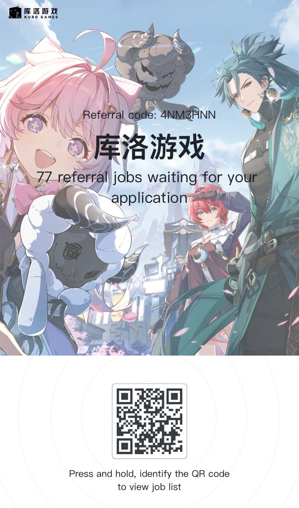

# 游戏公司内推 - 26届校园招聘

这个仓库收集整理了我和朋友们所在公司的内推码，主要面向2026届校园招聘的同学们。目前包含以下公司的内推资源：

- 米哈游
- 鹰角
- 腾讯
- 库洛游戏

## 🎯 使用说明

1. **选择公司**：在下方列表中找到你感兴趣的公司
2. **获取内推码**：复制对应的内推码或内推链接
3. **申请职位**：通过公司官方招聘渠道申请时使用内推码

## 🏢 公司列表

### 米哈游 (miHoYo)

- **官网**: [miHoYo校园招聘 - miHoYo招聘官网](https://jobs.mihoyo.com/#/campus)
- **内推码**: HZZ7D

  

### 鹰角网络 (Hypergryph)

- **官网:** [鹰角网络招聘官网](https://career.hypergryph.com/)
- **内推码**: 请扫码投递

  

### 腾讯 (Tencent)

- **官网:** [校园招聘 | 腾讯招聘](https://careers.tencent.com/campusrecruit.html)
- **内推码**: DBQMSUOJ

  

### 库洛游戏 (Kuro Games)

- **官网:** [库洛游戏校园招聘](https://kurogame.jobs.feishu.cn/campus/)
- **内推码:** 4NM3HNN

  

## ❓ 常见问题

**Q**: 内推和普通申请有什么区别？

**A**: 内推可以让你的简历获得优先筛选机会，部分公司会加快流程。

**Q**: 一个公司可以投多个岗位吗？

**A**: 不同公司政策不同，建议咨询内推人。

**Q**: 内推后多久会有反馈？

**A**: 通常1-2周，如长时间未收到回复可联系内推人查询。

## 🤝 贡献指南

欢迎有内推资源的朋友提交Pull Request或Issue分享你的内推码，格式参考现有内容。

## 📧 联系我们

如有问题或需要具体指导，可通过以下方式联系：

- 微信: 13757482694

祝各位26届同学求职顺利！🎉

------

*最后更新: 2025年8月*

*免责声明: 内推不保证录用结果，最终以公司招聘流程为准*